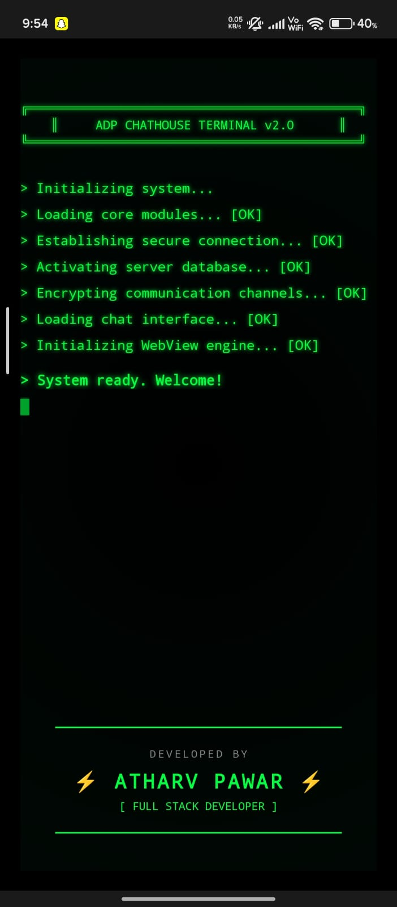
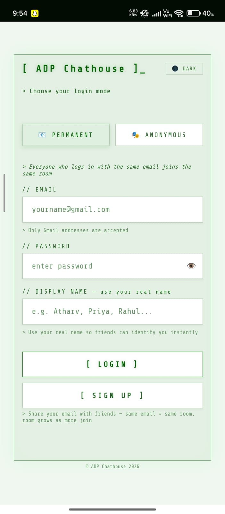
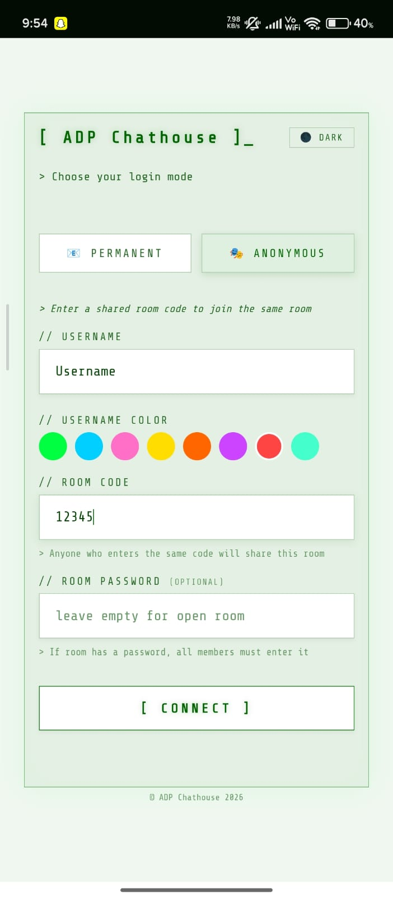
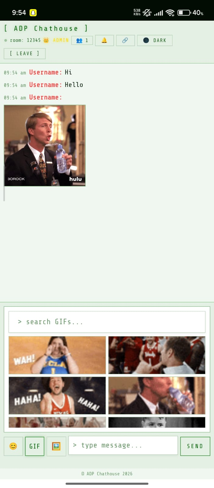

<div align="center">


# ADP Chathouse

**A real-time group chat app with a retro terminal aesthetic.**
No phone number. No social media. Just instant connection.

[](https://github.com/atharvpawar16/adpchathouse-app/releases/tag/v1.0.0)


</div>

---

## Screenshots

<div align="center">




</div>

<div align="center">
<sub>Login · Light Mode · Chat · Live Room</sub>
</div>

---

## What is ADP Chathouse?

ADP Chathouse is a real-time group chat application for Android. It wraps a Firebase-powered web app inside a native Android WebView, giving it a smooth, app-like feel with full offline resilience and push-ready architecture.

The UI is inspired by retro terminal aesthetics — monospace fonts, green-on-black, scan lines — with a clean light mode for everyday use.

---

## Features

| | Feature | Details |
|---|---------|---------|
| 🔐 | Permanent Login | Email + password via Firebase Auth. Same email = same room, always. |
| 🎭 | Anonymous Mode | Pick a username and room code — no account needed. |
| 🔒 | Private Rooms | Optional room passwords for anonymous rooms. |
| ⚡ | Real-time Sync | Messages sync instantly via Firebase Realtime Database. |
| 🖼️ | Image Sharing | Send images up to 5MB directly in chat. |
| 😊 | Emoji & GIF | Built-in emoji picker + GIF search. |
| 💬 | Reply & React | Quote messages and react with emoji. |
| ✍️ | Typing Indicators | Live typing status for all users in the room. |
| 👑 | Admin Controls | Room creator can delete messages and moderate. |
| 🌙 | Dark / Light Theme | Terminal dark mode + clean light mode toggle. |
| 📶 | Network Pulse | Live connection indicator with auto-reconnect. |
| 🔔 | Unread Badge | Unread message count when scrolled up. |
| 🔗 | Room Sharing | Share room links directly from the app. |

---

## Tech Stack

| Layer | Technology |
|-------|------------|
| Android | Java · Native WebView · AndroidX |
| Frontend | HTML5 · CSS3 · Vanilla JavaScript |
| Auth | Firebase Authentication |
| Database | Firebase Realtime Database |
| Hosting | Firebase Hosting |
| Min SDK | Android 7.0 (API 24) |
| Target SDK | Android 14 (API 34) |

---

## Project Structure

```
adpchathouse-app/
├── app/
│   └── src/main/
│       ├── java/com/adpchathouse/app/
│       │   ├── MainActivity.java       # WebView host + file chooser
│       │   ├── SplashActivity.java     # Animated splash screen
│       │   └── AndroidBridge.java      # JS ↔ Android interface
│       ├── assets/
│       │   ├── index.html              # Full web app (UI + Firebase logic)
│       │   ├── manifest.json           # PWA manifest
│       │   └── service-worker.js       # Offline caching
│       ├── res/                        # Icons, drawables, layouts, themes
│       └── AndroidManifest.xml
├── functions/
│   └── index.js                        # Cloud Functions placeholder
├── build.gradle
├── settings.gradle
└── README.md
```

---

## Getting Started

### Prerequisites
- Android Studio Hedgehog or newer
- JDK 17+
- A Firebase project with Realtime Database and Authentication enabled

### Setup

1. Clone the repo
   ```bash
   git clone https://github.com/atharvpawar16/adpchathouse-app.git
   ```

2. Open in Android Studio

3. Add your `google-services.json` to `app/` (not included — create your own Firebase project)

4. Update the Firebase config inside `app/src/main/assets/index.html` with your own project credentials

5. Build and run on a device or emulator

---

## Download

Get the latest release APK directly from the [Releases](https://github.com/atharvpawar16/adpchathouse-app/releases) page.

> Requires Android 7.0 or higher. Enable "Install from unknown sources" in your device settings.

---

## Security Notes

- Firebase API keys in the frontend are public by design — security is enforced via Firebase Security Rules
- The signing keystore is excluded from this repository
- `google-services.json` is excluded — you must provide your own

---

## Roadmap

- [ ] Push notifications via FCM
- [ ] Message search
- [ ] Voice messages
- [ ] User profiles and avatars
- [ ] End-to-end encryption

---

## Developer

**Atharv Pawar**
Android & Web Developer

[](https://github.com/atharvpawar16)

---

## Contributing

This is a personal project and PRs are not actively accepted. However, feel free to:
- Open an issue if you find a bug
- Fork the repo and build your own version
- Star the repo if you find it useful

---

## License

© 2026 Atharv Pawar. All rights reserved.
This project is personal and proprietary. Unauthorized use, copying, or distribution is not permitted.
